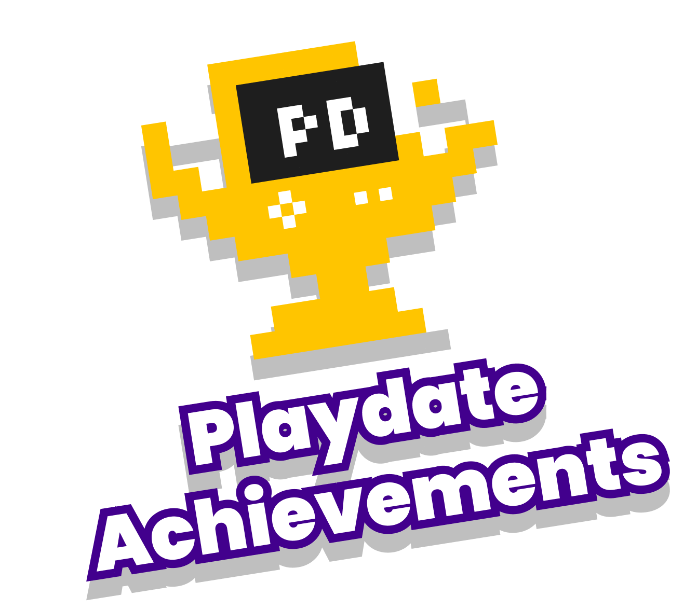

# 🏆 Playdate Achievements

	

##### An open achievement standard for the Playdate console.

1. _Play_ Playdate games!
2. _Earn_ achievements!
3. _View_ them in your Trophy Case!

Playdate Achievements is a community project establishing an open standard for achievements in [Playdate](https://play.date)™ games. Playdate is fun! Games on Playdate are fun! Achievements in games on Playdate are fun! Having a standard ensures a consistent experience for players, and makes it possible to view achievements earned across games in one place.

## _Everything_ On Display

[Trophy Case](https://gurtt.dev/trophy-case) is a dedicated viewer which displays the achievements you’ve earned across _all_ Playdate games in one place. Trophy Case was designed in parallel with the Playdate Achievements standard, providing first-class support for its features and showcasing any games which choose to integrate with it.

	

Of course, games may also present their earned achievements themselves. Additionally, the open standard makes it possible for others to create dedicated achievement viewer apps in the future.

## Show Me the Games!

It’s all about the games. Here’s a (non-comprehensive) list of games that award Playdate Achievements. Made your own? [Add it to the list!](#made-a-game-for-playdate)




	



 <!-- game grid -->

 <!-- section -->

### Made a Game for Playdate?

The Playdate Achievements framework makes it quick and easy to add achievements to your game! [Check out the Getting Started Guide](https://github.com/PlaydateSquad/pd-achievements/blob/main/README.md) in the [`pd-achievements` repo](https://github.com/PlaydateSquad/pd-achievements), which provides simple instructions along with everything you need to:

1. Grant achievements that integrate with Trophy Case.
2. Notify players when they earn achievements. _(optional)_
3. Display an in-game achievements viewer. _(optional)_

Don’t forget to [add it to this page](https://github.com/PlaydateSquad/pd-achievements#contributing) when you’re finished!

## FAQ



{{ faq.question }}
{{ faq.answer | markdownify }}



